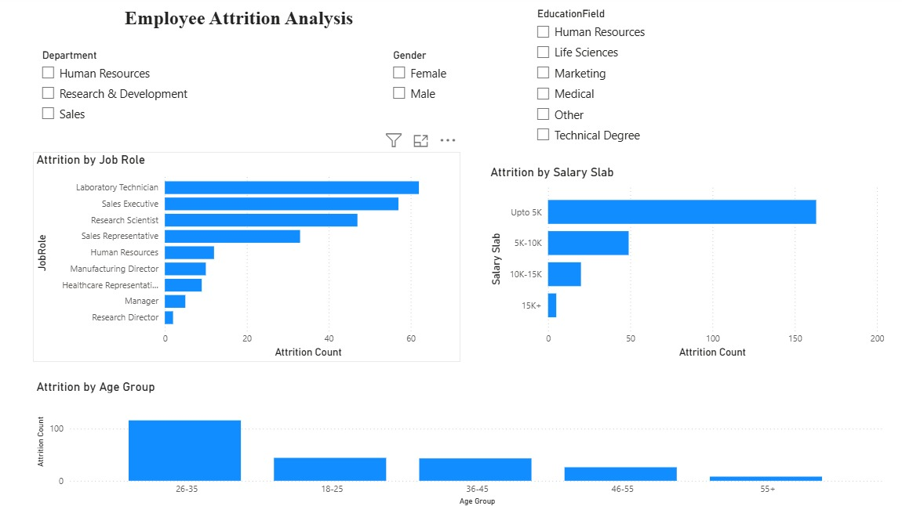

# HR Analytics Dashboard

## Project Overview

This Power BI dashboard analyzes employee attrition patterns and workforce demographics using HR data. The dashboard helps HR professionals understand employee turnover, salary distribution, job role trends, and key workforce insights.

## Dashboard Pages

### Page 1: HR Analytics Dashboard
- Total Employees
- Attrition Count
- Attrition Rate
- Active Employees
- Average Age
- Attrition by Department
- Attrition by Gender
- Attrition by Education Field

### Page 2: Employee Attrition Analysis
- Attrition by Job Role
- Attrition by Salary Slab
- Attrition by Age Group
- Interactive Filters

## Key Business Insights

1. Research & Development department has the highest attrition.
2. Employees earning below 5K show the highest attrition.
3. Employees aged 26–35 contribute the most to attrition.
4. Laboratory Technicians and Sales Executives show the highest employee turnover.
5. Male employees have higher attrition compared to female employees.
6. Life Sciences and Medical education backgrounds show higher attrition.
7. Attrition decreases as salary increases.

## Dashboard Screenshots

### HR Analytics Dashboard

### HR Analytics Dashboard


### Employee Attrition Analysis



## Tools Used

- Power BI
- DAX
- Data Modeling
- Data Visualization
- Microsoft Excel

## Repository Structure

```text
HR-Analytics-Dashboard/
│
├── dataset/
├── power_bi/
├── screenshots/
├── business_insights.txt
├── README.md
└── LICENSE
